<div align="center">

# RingSync

**A distributed data-parallel training framework built from scratch on raw TCP sockets.**

No `torch.distributed`. No NCCL. No MPI. No Horovod. No Ray. No gRPC.

[](https://www.python.org/)
[](https://pytorch.org/)
[](#license)

[Overview](#overview) &middot;
[Documentation](#documentation) &middot;
[Architecture](#high-level-architecture) &middot;
[Benchmarking](#benchmarking) &middot;
[Installation](#installation) &middot;
[Usage](#usage)

</div>

---

## Table of Contents

- [Overview](#overview)
- [Motivation](#motivation)
- [Features](#features)
- [Documentation](#documentation)
- [High-Level Architecture](#high-level-architecture)
- [Benchmarking](#benchmarking)
- [RingSync Benchmark Studio](#ringsync-benchmark-studio)
- [Screenshots](#screenshots)
- [Project Structure](#project-structure)
- [Tech Stack](#tech-stack)
- [Installation](#installation)
- [Usage](#usage)
- [Limitations](#limitations)
- [Future Work](#future-work)
- [Contributing](#contributing)
- [License](#license)
- [Author](#author)

---

## Overview

RingSync is a distributed data-parallel (DDP) training framework in which every networking, synchronization, and fault-detection component is implemented from first principles. PyTorch is used exclusively for what it is fundamentally for — local tensor operations, autograd, and neural network layers. Everything that makes training *distributed* — the wire protocol, the ring topology, the reduce-scatter/all-gather all-reduce algorithm, gradient synchronization, and fault detection — is hand-written Python built directly on the standard library's `socket` and `multiprocessing` modules.

This project does **not** use:

- `torch.distributed`
- `DistributedDataParallel`
- MPI
- NCCL
- Horovod
- gRPC
- Ray

The goal is not to compete with these systems on performance. It is to demonstrate, at the implementation level, how a synchronous data-parallel training system actually works — the same reduce-scatter/all-gather approach used internally by NCCL and Horovod, built visibly rather than hidden behind a library call.

RingSync ships with a full benchmarking engine and an interactive dashboard (**RingSync Benchmark Studio**) for configuring experiments, watching them run live, and analyzing the results.

---

## Motivation

Most engineers who use `DistributedDataParallel` never see what happens beneath it: how gradients actually cross the network, why a ring topology is bandwidth-efficient, or what a synchronization barrier costs in practice. RingSync exists to make those mechanics inspectable — every socket call, every byte of framing, every step of the all-reduce algorithm is plain, readable Python, with an accompanying benchmark suite that quantifies the real cost of communication rather than asserting it.

---

## Features

- **Custom TCP wire protocol** with explicit message framing and reliable partial-read/partial-write handling
- **Ring topology bootstrapping** — workers self-organize into a ring and perform a handshake to confirm correct neighbor assignment
- **Ring all-reduce** (reduce-scatter + all-gather), implemented against abstract send/receive functions and unit-tested independently of any networking code
- **Gradient synchronization** via a single flattened communication buffer per step, conceptually equivalent to gradient bucketing
- **True process-level parallelism** — every worker is an independent OS process, not a thread, communicating exclusively over TCP
- **Fault detection and shard redistribution** — an orchestrator process monitors worker heartbeats and reassigns data on failure
- **Verified correctness** — final model weights are compared bit-for-bit across all workers after training
- **A complete benchmarking engine** — multi-threaded baseline, single-threaded baseline, and distributed runs, with speedup, scaling efficiency, and communication-overhead metrics
- **RingSync Benchmark Studio** — a Streamlit dashboard for configuring, running, monitoring, and analyzing benchmarks, with PDF export and experiment history

---

## Documentation

This README covers what RingSync is, how it's structured at a high level, and how to install and run it. Implementation-level detail lives in `docs/`:

| Document | Description |
|---|---|
| [docs/architecture.md](docs/architecture.md) | System architecture and execution flow |
| [docs/protocol.md](docs/protocol.md) | The custom TCP communication protocol |
| [docs/ring-allreduce.md](docs/ring-allreduce.md) | The ring all-reduce algorithm, in full |
| [docs/benchmarking.md](docs/benchmarking.md) | Benchmark methodology and performance analysis |

---

## High-Level Architecture

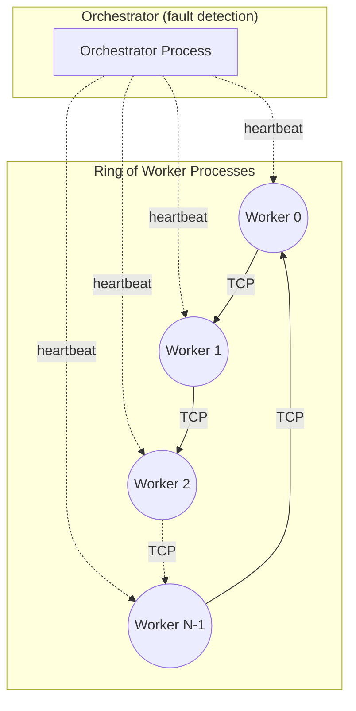

Each worker is an independent OS process holding two persistent TCP connections for the lifetime of training: an outbound connection to its right neighbor, and an inbound connection accepted from its left neighbor. The orchestrator is a separate process that tracks liveness only — it never sits in the gradient-exchange path. A full walkthrough of the execution flow, from process startup to shutdown, is in [docs/architecture.md](docs/architecture.md).

### Wire Protocol

Every worker connection uses a custom binary framing protocol built directly on raw TCP sockets — a fixed-size header followed by a payload, with explicit `send_exact`/`recv_exact` loops handling TCP's partial-read and partial-write behavior correctly.

For the full frame format, serialization scheme, and connection-lifecycle handshake, see **[docs/protocol.md](docs/protocol.md)**.

### Ring Topology

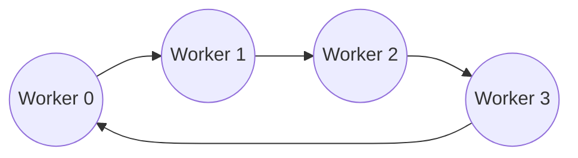

At startup, each worker binds a listener, accepts an inbound connection from its left neighbor, and connects out to its right neighbor — forming a ring with no central coordinator in the data path.

### Ring All-Reduce

Gradient synchronization uses the standard two-phase ring all-reduce:

- **Reduce-Scatter** — the gradient is split into chunks, which are progressively summed as they're passed around the ring, until each worker holds exactly one fully-reduced chunk.
- **All-Gather** — those reduced chunks then circulate the ring again so that every worker ends up holding the complete, fully-reduced result.

This is bandwidth-optimal and has no central bottleneck node, which is why ring-based collectives are the default strategy in NCCL and Horovod rather than a parameter-server topology.

For the full step-by-step algorithm, indexing scheme, and the correctness proof behind it, see **[docs/ring-allreduce.md](docs/ring-allreduce.md)**.

### Gradient Synchronization, Process Model, and Fault Handling

Gradients are flattened into a single communication buffer per training step (conceptually equivalent to gradient bucketing), synchronized via ring all-reduce, then scattered back into each parameter's `.grad`. Every worker runs as an independent OS process pinned to a single CPU thread, communicating only through explicit message passing — there is no shared memory or GIL contention between workers. A separate orchestrator process monitors heartbeats and redistributes a failed worker's data shard among survivors at the next epoch boundary. Full detail on all three is in [docs/architecture.md](docs/architecture.md).

### Correctness Validation

Distributed training correctness is not asserted — it is measured. After training completes, the final model weights of every worker are compared directly, using real, separate OS processes communicating over real TCP sockets, on data shards that are disjoint by construction. The result: **0.00e+00 maximum difference** across all workers, at every tested world size.

<p align="center">
  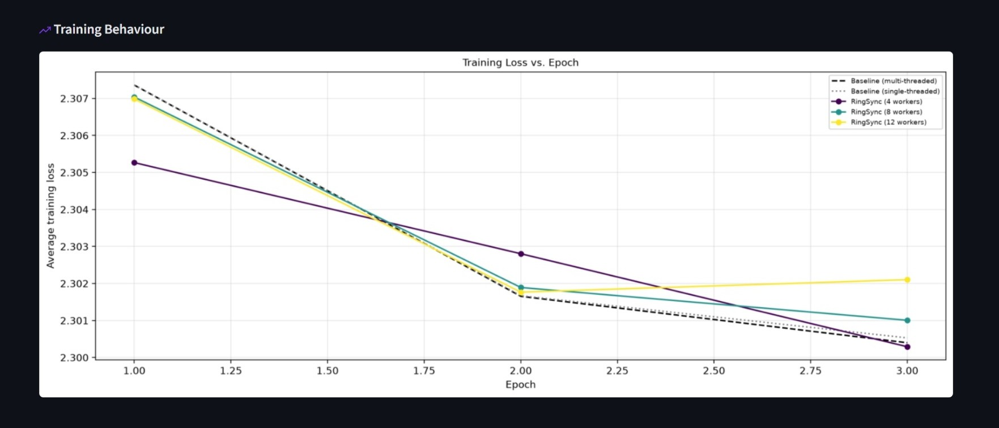
  <br>
  <em>Training loss curves for the single-process baseline and multiple RingSync worker-count configurations, converging to the same final loss — distributed synchronization preserves convergence rather than trading it for speed.</em>
</p>

---

## Benchmarking

RingSync's benchmark engine runs three kinds of configuration:

| Configuration | What it measures |
|---|---|
| **Multi-threaded baseline** | A single process using PyTorch's default automatic multi-threading — what most users get by default without any distribution |
| **Single-threaded baseline** | The same single-process run, pinned to one thread — an apples-to-apples comparison against a single RingSync worker |
| **Distributed (RingSync)** | The real ring all-reduce training run, at any selected worker count |

Two baselines exist because they answer two different questions: whether distribution beats what a user gets by default, and whether it beats an equivalent single thread — isolating the benefit of data-parallelism itself from the unrelated benefit of PyTorch's intra-op threading.

**Core metrics:** Speedup (Baseline Runtime ÷ RingSync Runtime), Scaling Efficiency (Speedup ÷ Workers), and Communication Overhead (Communication Time ÷ Total Step Time) — each computed directly from per-worker timing data.

<p align="center">
  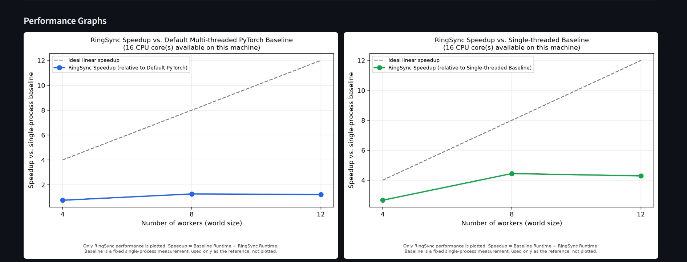
  <br>
  <em>RingSync speedup against the default multi-threaded baseline (left) and the single-threaded baseline (right) — the same underlying runs, viewed against two different reference points.</em>
</p>

For the full methodology, every metric's exact formula, and a worked interpretation of real results, see **[docs/benchmarking.md](docs/benchmarking.md)**.

---

## RingSync Benchmark Studio

RingSync ships with an interactive local dashboard (Streamlit) for running and analyzing benchmarks without hand-editing configuration constants or reading raw logs.

**Capabilities:**

- **Experiment configuration** — worker-count selection (bounded by detected core count to avoid oversubscription), baseline choice, batch size, epochs, and learning rate
- **Live progress** — a progress bar per configuration, updating in real time from the running subprocess
- **Resource monitoring** — live CPU utilization, RAM usage, active process count, and network I/O, sampled directly from the benchmark's process tree while it runs
- **Results dashboard** — KPI summary cards, full experiment configuration, and auto-detected system information (CPU model, logical/physical core counts, RAM, Python and PyTorch versions, OS)
- **Auto-generated insights** — data-driven narrative bullet points (best speedup, communication overhead trend, baseline crossover point, convergence consistency), computed from the results, not hardcoded
- **PDF report export** — a self-contained report including the logo, summary, system information, insights, and every chart
- **Experiment history** — every run is saved under a unique experiment ID with its own results folder, and past runs can be browsed and compared on a shared speedup chart

---

## Screenshots

<p align="center">
  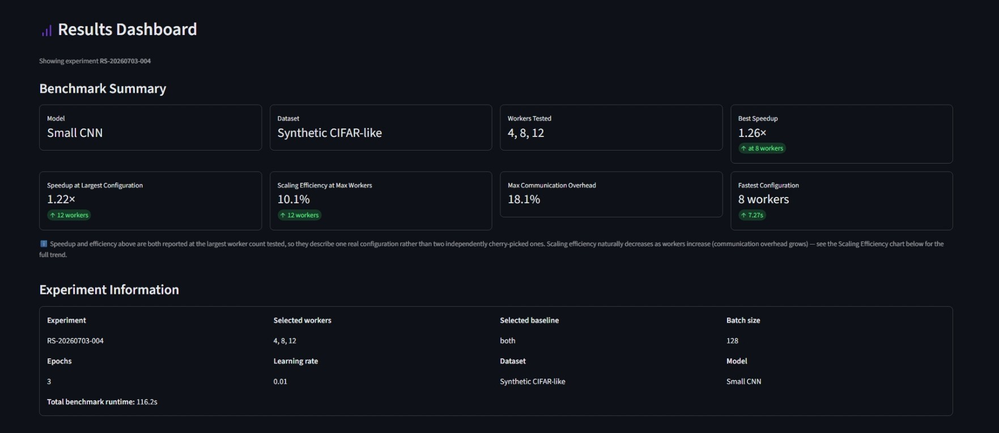
  <br>
  <em>Benchmark Summary and Experiment Information — KPI cards report speedup and scaling efficiency at the same worker count, rather than independently cherry-picked maxima.</em>
</p>

<p align="center">
  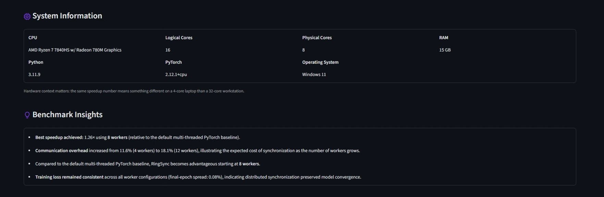
  <br>
  <em>Auto-detected system information alongside data-driven benchmark insights — hardware context and interpretation, generated automatically from the run's own results.</em>
</p>

<p align="center">
  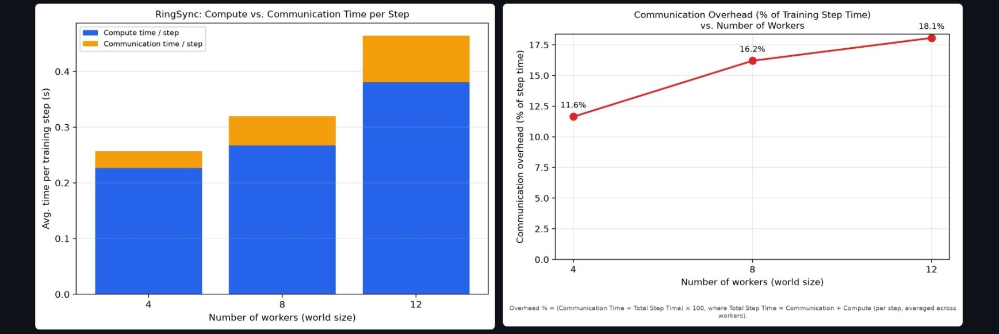
  <br>
  <em>Compute vs. communication time per step, and communication overhead as a percentage of total step time — the metric that most directly explains why speedup falls short of ideal as workers increase.</em>
</p>

<p align="center">
  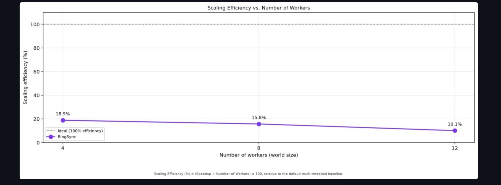
  <br>
  <em>Scaling efficiency trend across worker counts. Efficiency decreasing as workers increase is the expected, textbook shape for a real synchronous system — not a defect.</em>
</p>

---

## Project Structure

```
RingSync/
├── ringsync/                       # core distributed training package
│   ├── model.py                    # model definition (seeded, deterministic init)
│   ├── data.py                     # dataset + deterministic sharding across workers
│   ├── network/
│   │   ├── socket_utils.py         # send_exact / recv_exact -- reliable TCP I/O
│   │   ├── protocol.py             # wire format, message framing, tensor (de)serialization
│   │   └── topology.py             # ring bootstrapping (accept + connect, concurrently)
│   ├── allreduce/
│   │   └── ring_allreduce.py       # reduce-scatter + all-gather
│   ├── worker/
│   │   ├── grad_utils.py           # flatten/unflatten gradients <-> flat buffer
│   │   └── worker_node.py          # per-worker training loop
│   └── orchestrator/
│       ├── fault_handler.py        # shard redistribution logic
│       └── server.py               # heartbeat monitoring, eviction, roster
├── baseline/
│   └── train_single_process.py     # single-process ground-truth training
├── scripts/
│   ├── benchmark_core.py           # parameterized benchmark orchestration
│   ├── plot_benchmark.py           # chart generation
│   ├── report_content.py           # shared summary/insight computation
│   ├── report_export.py            # PDF report generation
│   ├── system_info.py              # hardware/software detection
│   ├── resource_monitor.py         # live CPU/RAM/process/network sampling
│   ├── experiment_utils.py         # experiment IDs and result directories
│   ├── run_benchmark.py            # CLI entrypoint
│   └── make_logo_transparent.py    # logo asset preprocessing
├── dashboard/
│   └── benchmark_studio.py         # RingSync Benchmark Studio (Streamlit app)
├── docs/                           # implementation-level documentation
│   ├── architecture.md
│   ├── protocol.md
│   ├── ring-allreduce.md
│   └── benchmarking.md
├── tests/                          # unit and integration tests
├── assets/                         # logo and README images
├── results/                        # per-experiment output (results/RS-YYYYMMDD-NNN/)
├── .streamlit/
│   └── config.toml                 # light/dark theme definitions
└── requirements.txt
```

---

## Tech Stack

| Component | Purpose |
|---|---|
| **Python** | Core implementation language |
| **PyTorch** | Local tensor operations, autograd, and neural network layers only — no distributed APIs |
| **socket** | Raw TCP networking — the entire wire protocol and ring topology |
| **multiprocessing** | True process-level parallelism for workers and baseline isolation |
| **Streamlit** | RingSync Benchmark Studio, the interactive dashboard |
| **matplotlib** | All benchmark chart generation |
| **ReportLab** | PDF report generation |
| **psutil** | Hardware detection and live resource monitoring |
| **py-cpuinfo** | CPU model identification |

---

## Installation

**Requirements:** Python 3.10 or later.

```bash
# Clone the repository
git clone https://github.com/Noel-Ann-Roy/RingSync.git 
cd RingSync

# Create and activate a virtual environment
python -m venv venv
venv\Scripts\activate        # Windows
source venv/bin/activate     # macOS/Linux

# Install dependencies
pip install -r requirements.txt
```

---

## Usage

**Run the interactive dashboard:**

```bash
streamlit run dashboard/benchmark_studio.py
```

Configure worker counts, baseline comparison, and training parameters in the browser, then run the benchmark and monitor live progress, resource usage, and logs. Results, charts, and an optional PDF report are generated automatically once the run completes.

<p align="center">
  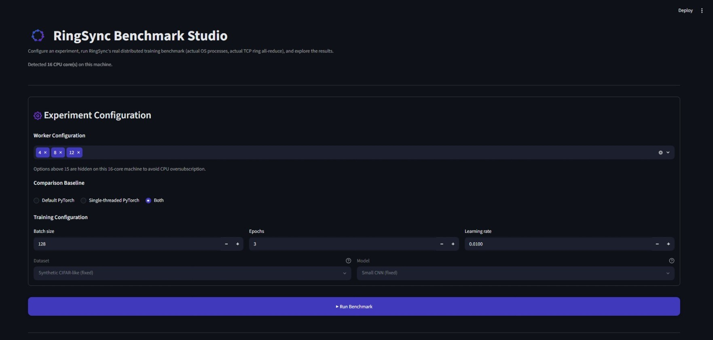
  <br>
  <em>Experiment configuration — worker selection, baseline comparison, and training parameters.</em>
</p>

<p align="center">
  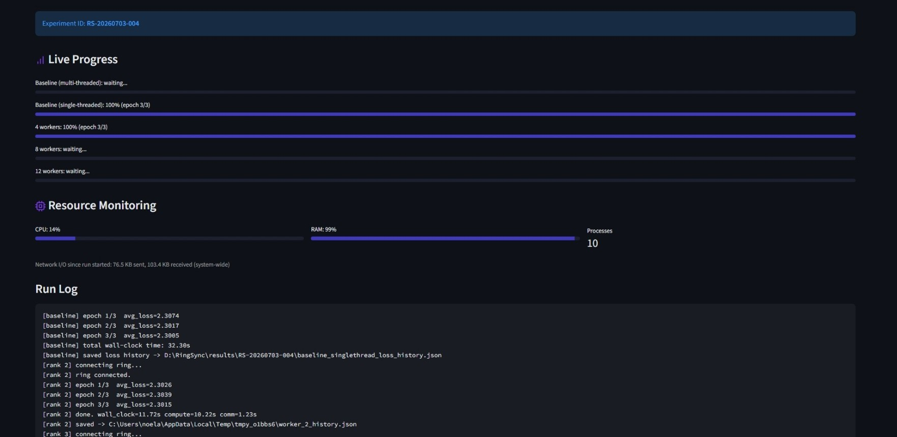
  <br>
  <em>Live per-configuration progress bars and resource monitoring (CPU, RAM, active processes, network I/O) while a benchmark is running.</em>
</p>

**Run a benchmark from the command line:**

```bash
python scripts/run_benchmark.py --world-sizes "2,4,8" --epochs 3 --batch-size 128 --baseline both
```

**Generate charts from an existing result set:**

```bash
python scripts/plot_benchmark.py
```

**Export a PDF report, view history, and compare runs** directly from the dashboard:

<p align="center">
  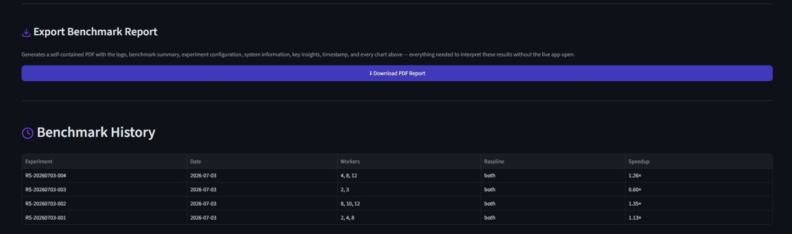
  <br>
  <em>PDF report export and benchmark history — every run is saved under its own experiment ID and remains browsable afterward.</em>
</p>

<p align="center">
  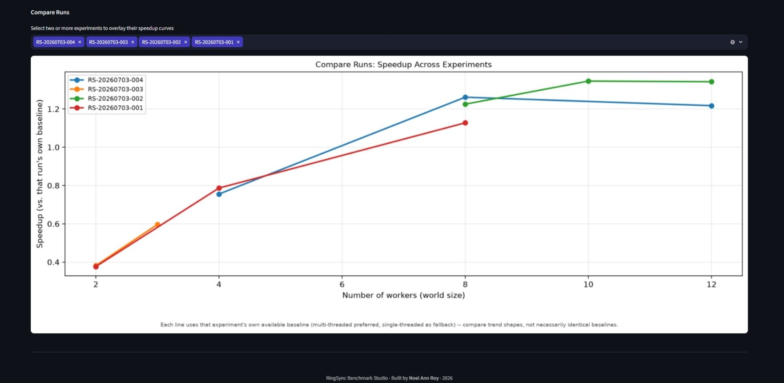
  <br>
  <em>Compare Runs overlays the speedup curves of multiple past experiments on a single chart.</em>
</p>

**Run the test suite:**

```bash
pytest tests/ -v --ignore=tests/test_worker_integration.py   # fast unit tests
python tests/test_worker_integration.py                       # real multi-process integration test
```

---

## Limitations

RingSync is a research and educational implementation, stated plainly:

- **CPU-only.** No GPU communication (NCCL-style GPU-to-GPU transfer) is implemented.
- **Single-machine.** Workers run as separate processes on one machine, communicating over `localhost` TCP. The protocol does not assume this, but multi-machine operation has not been tested.
- **Synchronous only.** There is no asynchronous or stale-gradient training path; a slow worker blocks the entire ring until the next epoch boundary.
- **Fault tolerance is epoch-boundary only.** A worker failing mid-collective-operation is not recovered; only failures between epochs are handled.
- **Not a production replacement** for PyTorch Distributed, NCCL, or Horovod. Those systems are the correct choice for real distributed training workloads; RingSync's purpose is to make the underlying mechanics visible, not to outperform them.

---

## Future Work

- GPU-to-GPU communication and comparison against NCCL
- Multi-node execution across real network links (not just localhost)
- Gradient compression (quantization, sparsification)
- Mixed-precision training
- Elastic training (dynamic worker join/leave mid-run)
- Checkpointing and resume
- Distributed inference
- Pipeline and tensor parallelism, as an alternative to pure data parallelism
- Expanded dashboard: live multi-user experiment sharing, richer historical analytics

---

## Contributing

This project began as a personal systems-engineering exercise, but issues, suggestions, and pull requests are welcome — particularly around the items listed in Future Work. If you're proposing a non-trivial change, please open an issue first to discuss the approach.

---

## License

Distributed under the MIT License. See `LICENSE` for details.

---

## Author

**Noel Ann Roy**