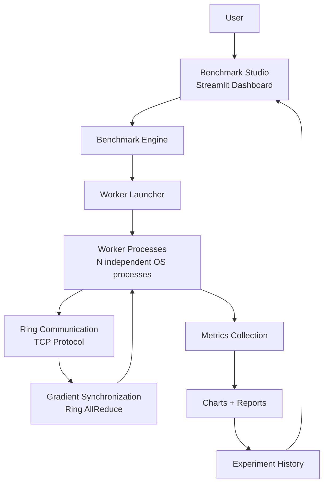
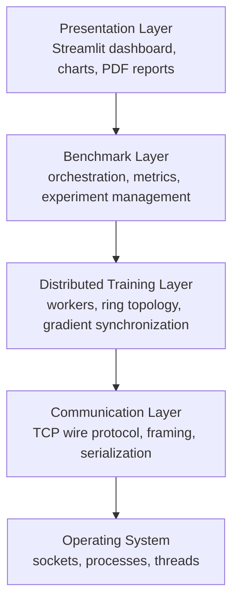
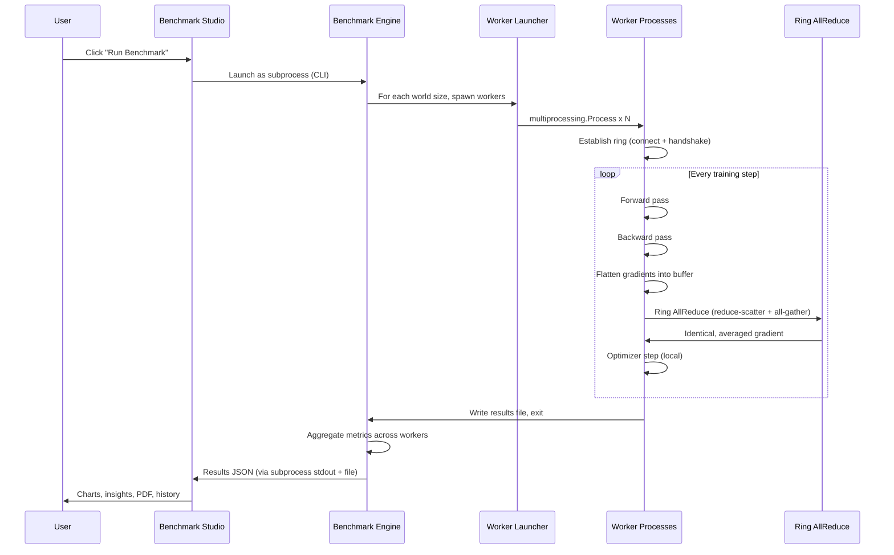
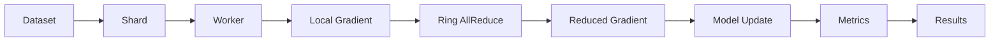
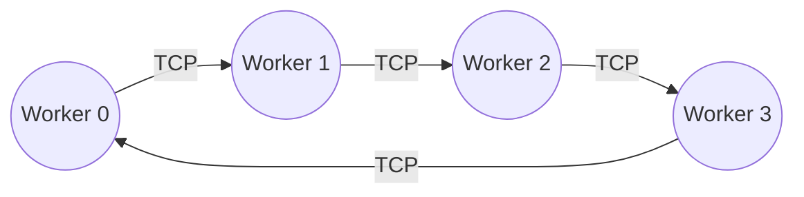
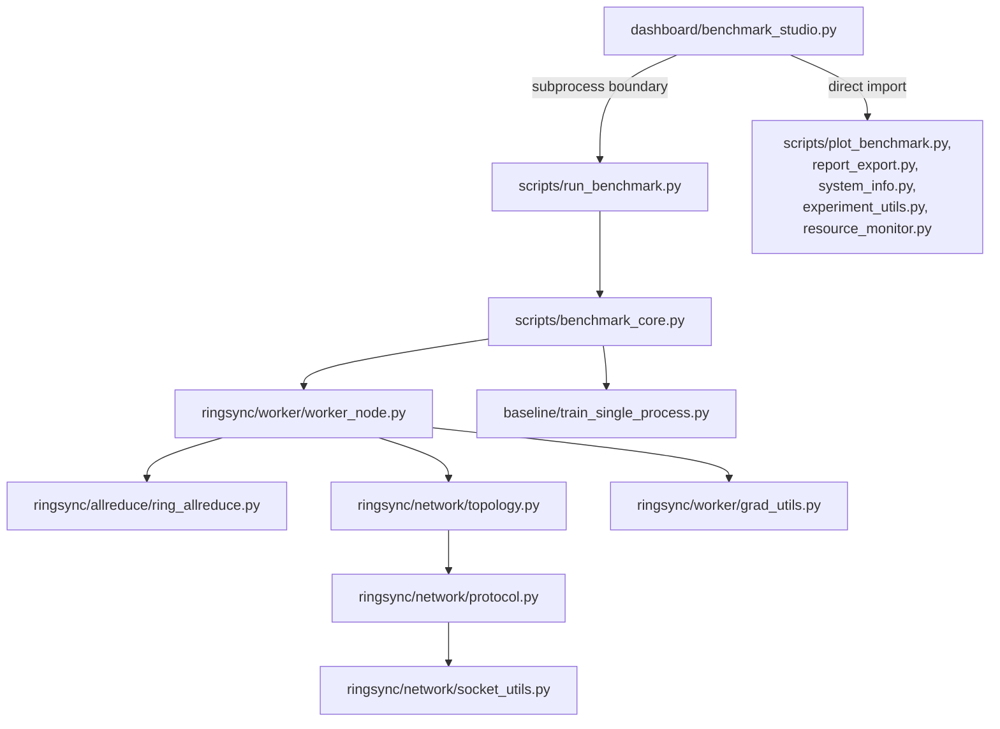
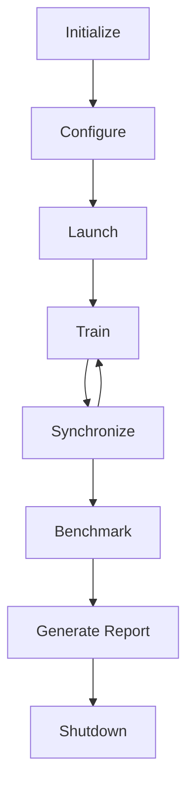

# RingSync System Architecture

This document describes how RingSync is organized as a system: its subsystems, how they depend on one another, how a training run actually executes from the moment a user clicks a button to the moment a chart appears on screen, and the reasoning behind the major structural decisions. It assumes familiarity with *what* RingSync is (see the [README](../README.md)) and focuses entirely on *how it is built*.

Three companion documents go deeper on individual subsystems this document only introduces: [protocol.md](protocol.md) (the TCP wire protocol), [ring-allreduce.md](ring-allreduce.md) (the synchronization algorithm), and [benchmarking.md](benchmarking.md) (measurement methodology). This document is the map; those three are the detailed terrain.

---

## Introduction

RingSync is composed of several independent subsystems that, together, implement a distributed data-parallel training framework: networking, distributed synchronization, orchestration, benchmarking, and visualization. These are deliberately kept as separate concerns rather than combined into one monolithic training script.

This separation is not incidental. Networking code (framing, sockets, connection lifecycle) has to be correct at the byte level and is most easily tested in isolation from anything involving PyTorch. Distributed synchronization (the ring all-reduce algorithm) is pure numerical logic that should be verifiable without a live socket. Benchmarking and visualization are concerns that a *user* of a distributed training system cares about, but that have nothing to do with whether the underlying synchronization is correct. A monolithic implementation would make each of these harder to test, harder to reason about, and harder to change independently — which is precisely why RingSync does not have one.

---

## High-Level Architecture



**User** interacts with the system through a browser, configuring an experiment and clicking a single button.

**Benchmark Studio** is the Streamlit application — the only subsystem the user directly sees. It collects configuration, triggers a run, and renders every result.

**Benchmark Engine** owns the actual orchestration logic: which baselines to run, in what order, with what parameters, and how to assemble raw timing data into the metrics described in [benchmarking.md](benchmarking.md).

**Worker Launcher** is the code responsible for spawning the right number of OS processes with the right arguments — a distinct responsibility from *what those processes do once running*.

**Worker Processes** are where local training actually happens: forward pass, backward pass, and the trigger into ring communication.

**Ring Communication** is the TCP layer connecting each worker to its two ring neighbors — detailed fully in [protocol.md](protocol.md).

**Gradient Synchronization** is the ring all-reduce algorithm itself, running on top of that TCP layer — detailed fully in [ring-allreduce.md](ring-allreduce.md). Its output flows back into the worker processes, which apply the optimizer step locally.

**Metrics Collection** gathers per-worker timing and loss data once training completes.

**Charts + Reports** transform that raw data into the visual and PDF artifacts a user actually reads.

**Experiment History** persists every run under a unique identifier, feeding back into the dashboard so past results remain browsable and comparable.

---

## Project Layering

RingSync can be understood as five layers, each depending only on the layer(s) below it:



- **Presentation Layer** — everything the user looks at: the dashboard's widgets, generated charts, PDF reports. This layer has no knowledge of TCP or multiprocessing at all; it only reads structured results.
- **Benchmark Layer** — decides *what* to run and *how to measure it*: which baselines, which world sizes, how raw timings become speedup and efficiency numbers. It has no knowledge of socket framing; it only knows to launch workers and read back their results.
- **Distributed Training Layer** — the actual training loop and the ring all-reduce algorithm operating on flattened gradients. It depends on the communication layer to move bytes, but the all-reduce algorithm itself is written against abstract send/receive functions, not sockets directly (see Design Decisions).
- **Communication Layer** — the wire protocol: message framing, `send_exact`/`recv_exact`, serialization. This layer knows nothing about gradients, models, or training — it moves bytes reliably and nothing more.
- **Operating System** — raw TCP sockets and OS processes, which every layer above ultimately rests on.

Each layer is a strictly narrower concern than the one above it, and none of them reach *upward* — the communication layer never imports anything from the training layer, and the training layer never imports anything from the benchmark layer. Dependencies point one direction only (detailed further under Module Dependencies).

---

## Core Components

### Benchmark Studio
*File: `dashboard/benchmark_studio.py`*
**Purpose:** the interactive front end. **Responsibilities:** experiment configuration, launching runs, live progress and resource-usage display, and rendering every downstream artifact (KPI cards, charts, insights, PDF export, experiment history). **Inputs:** user-selected worker counts, baseline mode, batch size, epochs, learning rate. **Outputs:** none directly — it triggers the Benchmark Engine and renders whatever that engine produces. **Interacts with:** the Benchmark Engine (via a subprocess, not a direct import — see Module Dependencies), and directly imports the Chart Generator, Report Generator, and Experiment Storage modules for rendering.

### Benchmark Engine
*File: `scripts/benchmark_core.py`*
**Purpose:** orchestrates an entire benchmark run. **Responsibilities:** running the selected baseline(s), looping over selected world sizes, computing derived metrics (speedup, efficiency, overhead) from raw timings, and writing the final results JSON. **Inputs:** world sizes, baseline mode, training hyperparameters. **Outputs:** a structured results dictionary, persisted to disk. **Interacts with:** the Worker Launcher (which it contains), Experiment Storage (to obtain an experiment ID and result directory), and the baseline training script.

### Worker Launcher
*Function: `run_distributed_config()` and `_worker_entrypoint()`, inside `scripts/benchmark_core.py`*
**Purpose:** spawns exactly the right number of OS processes with the right arguments. **Responsibilities:** constructing per-worker addresses, launching `multiprocessing.Process` instances, waiting for all of them to exit, and reading back each one's saved results file. **Inputs:** world size, port assignments, training parameters. **Outputs:** a list of worker result dictionaries. **Interacts with:** Worker Processes (spawns them) and the Benchmark Engine (returns results to it).

### Worker Processes
*File: `ringsync/worker/worker_node.py`*
**Purpose:** the actual training loop running independently in each process. **Responsibilities:** loading a local data shard, running forward/backward passes, invoking gradient synchronization, applying the optimizer step, and recording per-step timing. **Inputs:** rank, world size, peer addresses, training hyperparameters. **Outputs:** a per-worker results file (loss history, timing breakdown). **Interacts with:** Ring Topology (to establish connections), Ring AllReduce (to synchronize gradients), and the Gradient Bridge (to move between PyTorch tensors and the flat buffer all-reduce operates on).

### Ring Topology
*File: `ringsync/network/topology.py`*
**Purpose:** establishes the physical ring. **Responsibilities:** binding a listener, accepting the left-neighbor connection concurrently with connecting out to the right neighbor, and performing the rank-confirmation handshake. **Inputs:** this worker's rank, world size, the full address list. **Outputs:** two live, connected sockets (inbound, outbound). **Interacts with:** the TCP Protocol module (for the handshake message format) and Worker Processes (which call it once, at startup).

### TCP Protocol
*Files: `ringsync/network/protocol.py`, `ringsync/network/socket_utils.py`*
**Purpose:** reliable message framing over raw sockets. **Responsibilities:** the 9-byte frame header, `send_exact`/`recv_exact`, and tensor/JSON serialization. Fully detailed in [protocol.md](protocol.md). **Interacts with:** every other networked component — Ring Topology, Ring AllReduce, and the (independently-tested) Orchestrator all move bytes through this module and nothing else.

### Ring AllReduce
*File: `ringsync/allreduce/ring_allreduce.py`*
**Purpose:** the synchronization algorithm itself. **Responsibilities:** reduce-scatter and all-gather over a flattened gradient buffer. Fully detailed in [ring-allreduce.md](ring-allreduce.md). **Inputs:** a local gradient array, rank, world size, and abstract `send_fn`/`recv_fn` callables. **Outputs:** the fully-reduced (or averaged) gradient array, identical across every worker. **Interacts with:** Worker Processes (which supply `send_fn`/`recv_fn` implementations backed by the live ring sockets) — notably, this module has no direct dependency on sockets at all (see Design Decisions).

### Gradient Bridge
*File: `ringsync/worker/grad_utils.py`*
**Purpose:** translates between PyTorch's per-parameter gradient tensors and the single flat buffer Ring AllReduce operates on. **Responsibilities:** flattening every parameter's `.grad` into one buffer in a fixed, deterministic order; scattering the reduced result back afterward. **Interacts with:** Worker Processes (called immediately before and after every all-reduce call).

### Fault Handler
*Files: `ringsync/orchestrator/server.py`, `ringsync/orchestrator/fault_handler.py`*
**Purpose:** demonstrates heartbeat-based failure detection and data redistribution. **Responsibilities:** worker registration, heartbeat tracking, eviction of unresponsive workers, and recomputing shard assignments among survivors. **Status:** this subsystem is real and independently tested (`tests/test_orchestrator.py`), but is **not currently invoked by the live benchmark execution path** described under Training Execution Flow below — the Benchmark Engine does not launch an orchestrator process or register workers with one. It exists as a working, tested demonstration of the fault-detection design, documented honestly here rather than depicted as active in every run. See Fault Handling, below, for what it does when used.

### Metrics Collector
*Distributed across `ringsync/worker/worker_node.py` (per-step timers) and `scripts/benchmark_core.py` (aggregation)*
**Purpose:** turns raw per-worker timing into the structured data every downstream chart and report reads. **Responsibilities:** timing compute and communication phases separately inside each worker, then reading every worker's saved file back and computing speedup/efficiency/overhead. **Interacts with:** Worker Processes (source of raw timings) and the Chart/Report Generators (consumers of the aggregated result).

### Chart Generator
*File: `scripts/plot_benchmark.py`*
**Purpose:** produces every visualization RingSync generates. **Responsibilities:** rendering speedup, efficiency, overhead, compute-vs-communication, and training-loss charts from the aggregated results. **Interacts with:** the Benchmark Studio (which calls it directly, in-process) and the Report Generator (which embeds its output into the PDF).

### Report Generator
*Files: `scripts/report_export.py`, `scripts/report_content.py`*
**Purpose:** produces the self-contained PDF report. **Responsibilities:** assembling the logo, summary tables, system information, insights, and every chart into one document. **Interacts with:** the Chart Generator (for chart images), System Information (for hardware context), and Experiment Storage (for the target output path).

### Experiment Storage
*File: `scripts/experiment_utils.py`*
**Purpose:** experiment identity and persistence. **Responsibilities:** generating unique experiment IDs, creating each experiment's dedicated results directory, and listing past experiments for the history view. **Interacts with:** the Benchmark Engine (which requests an ID at the start of every run) and the Benchmark Studio (which reads the experiment list back for the history/comparison view).

---

## Training Execution Flow



**User clicks Run Benchmark** — the only manual step in the entire flow. **Benchmark Studio launches the Benchmark Engine as a subprocess** rather than calling it directly (see Module Dependencies for why). **Benchmark Engine spawns workers** for each selected world size in turn, via the Worker Launcher. **Workers connect and build the ring** — each establishing its two neighbor connections and confirming rank identity via handshake (see [protocol.md](protocol.md)). **Forward and backward pass** happen entirely locally, identically to non-distributed training. **Gradients are flattened**, handed to Ring AllReduce, and the identical, averaged result is scattered back — the only point in the entire loop where workers communicate. **The optimizer step is local** (see [ring-allreduce.md](ring-allreduce.md#correctness) for why this is safe once gradients are synchronized). Once training completes, each worker **writes its results and exits**; the Benchmark Engine reads every worker's file back and computes the derived metrics; the Benchmark Studio renders the result.

---

## Data Flow



The dataset is deterministically **sharded** across workers before training begins — each worker sees a disjoint slice, never the whole dataset. Each **worker** computes a **local gradient** from its own shard, which is necessarily different from every other worker's local gradient, since the underlying data differs. **Ring AllReduce** is the one point where these diverging per-worker values become a single, shared value: the **reduced gradient**, identical everywhere. **Model update** (the optimizer step) consumes that shared value locally. **Metrics** are recorded throughout this process — not derived from the model itself, but from timers wrapped around each phase. **Results** are the final structured output of the whole pipeline: what every chart, insight, and report is built from.

---

## Communication Flow



Every worker communicates with exactly two others — its ring predecessor and successor — never with every other worker, and never through a central coordinator. This is the structural property that makes ring all-reduce scale the way it does: per-worker communication volume is fixed regardless of world size (see [ring-allreduce.md](ring-allreduce.md#computational-complexity) for the exact figure), because no worker ever needs to reach every other worker directly — the ring itself, over `N-1` rounds, propagates each contribution to everywhere it needs to go.

This is precisely why a ring scales better than a parameter server: a parameter server's central node receives from, and sends to, every worker directly, so its own network interface's capacity becomes a ceiling that gets closer as more workers are added. A ring has no analogous node — every participant's workload is identical and constant, so adding workers adds ring hops (linear in `N`, not central-node load), not central-node saturation.

---

## Directory Structure

```
RingSync/
├── ringsync/                       # distributed training core
│   ├── model.py, data.py           # model definition, dataset + sharding
│   ├── network/                    # Communication Layer (protocol, sockets, topology)
│   ├── allreduce/                  # Distributed Training Layer (ring all-reduce)
│   ├── worker/                     # Distributed Training Layer (training loop, gradient bridge)
│   └── orchestrator/                # fault detection (independently tested subsystem)
├── baseline/                       # single-process reference training
├── scripts/                        # Benchmark Layer (engine, metrics, charts, reports, storage)
├── dashboard/                       # Presentation Layer (Streamlit app)
├── docs/                           # this document and its companions
├── tests/                          # unit + integration tests
├── assets/                         # logo, README images
└── results/                        # per-experiment output (git-ignored, regenerated)
```

`ringsync/` contains everything that would still make sense as a standalone distributed-training library, with no knowledge that a benchmarking dashboard exists. `scripts/` and `dashboard/` contain everything that exists *because* RingSync also wants to be measured and demonstrated, not just implemented. That boundary is deliberate — see Design Principles, below.

---

## Module Dependencies



Two dependency relationships from the Benchmark Studio are worth distinguishing, because they exist for different reasons. The **direct imports** (chart generation, PDF export, system info, experiment storage, resource monitoring) are pure computation with no process-spawning involved — safe to call in-process, and doing so keeps the dashboard responsive. The **subprocess boundary** to `scripts/run_benchmark.py`, in contrast, exists specifically because launching `multiprocessing.Process` workers *directly from within a running Streamlit app* is unreliable in practice — spawned worker processes can end up attempting to re-import and re-execute the Streamlit script itself, a known interaction between Python's `multiprocessing` and Streamlit's execution model. Running the exact same, already-tested CLI script as an external process avoids this entirely, at the cost of an explicit process boundary the dashboard has to communicate across (via captured stdout and a shared results file) rather than a plain function call.

Below that boundary, dependencies run strictly downward: the Benchmark Engine depends on Worker Processes, which depend on Ring AllReduce and Ring Topology, which depend on the Protocol layer, which depends on nothing in this codebase but the standard library. Notably, **Ring AllReduce does not depend on the networking layer at all** — it is written against abstract `send_fn`/`recv_fn` callables, and Worker Processes are the component that supplies real, socket-backed implementations of those callables. This inversion is deliberate: it is what allows the all-reduce algorithm's correctness to be unit-tested with an in-memory simulated ring, with zero networking code involved, before it is ever run over a real socket (see [ring-allreduce.md](ring-allreduce.md#correctness)).

---

## Design Principles

**Separation of concerns.** Every subsystem in this document has one clearly stated purpose. The Protocol layer moves bytes; it does not know what a gradient is. Ring AllReduce reduces arrays; it does not know what a socket is. This is not an abstraction added for its own sake — it is what made independent testing of each piece possible in the first place.

**Modularity.** Layers depend downward only, and each module's dependencies are the minimum needed for its stated purpose (Module Dependencies, above). This is what allows, for instance, the Chart Generator to be reused identically by both the live dashboard and the CLI, with no coupling to either.

**Testability.** Components that can be tested without a live socket or a live subprocess are structured so that they can be — Ring AllReduce's algorithm, the wire protocol's framing logic, and the fault handler's redistribution math are all unit-tested in isolation, with real multi-process integration tests reserved for the components where no simulation can substitute for the real thing.

**Reusability.** The Chart Generator, Report Generator, and Experiment Storage modules have no knowledge of *how* a benchmark was launched (CLI or dashboard) — they operate purely on the structured results a run produces, which is what lets both entry points share them without duplication.

**Deterministic execution.** Every worker computes the same sequence of ring communication steps from the same inputs (rank, world size, step number) with no negotiation or randomness in that sequence — a property that is what makes the correctness guarantee in [ring-allreduce.md](ring-allreduce.md#correctness) provable rather than merely observed.

**Minimal dependencies.** The distributed training core depends on the Python standard library and NumPy/PyTorch, and nothing else — no distributed-computing framework, no RPC library. This is the direct architectural consequence of the project's stated purpose: making every dependency's internals inspectable rather than delegated.

---

## Design Decisions

**Raw TCP sockets, rather than gRPC or MPI** — covered fully in [protocol.md](protocol.md#design-decisions); in short, the point of the project is to make framing and connection handling visible, which a higher-level framework would hide.

**Python multiprocessing, rather than threading** — genuine OS-level parallelism, unconstrained by the GIL, and a closer analogue to how real multi-machine training actually works (no shared memory between workers at all).

**Ring AllReduce, rather than a parameter server** — no central bottleneck node, constant per-worker communication cost regardless of world size (see Communication Flow, above, and [ring-allreduce.md](ring-allreduce.md#why-ring-allreduce)).

**Persistent socket connections, rather than reconnecting per step** — ring topology is established once, at startup, and reused for every training step's all-reduce call; reconnecting per step would add a full TCP handshake's latency to every single step, for no benefit, since the ring's membership does not change mid-run.

**Gradient flattening, rather than one all-reduce call per parameter tensor** — amortizes fixed per-message overhead across one call per step instead of one per tensor (detailed in [ring-allreduce.md](ring-allreduce.md#gradient-flattening)).

**A separate orchestrator, rather than folding fault detection into the workers themselves** — heartbeat monitoring and eviction decisions are logically distinct from training, and keeping them in an independent process (even though, as noted above, this process isn't currently wired into live runs) means that logic can be developed and tested without needing a live training job to exercise it.

**A Benchmark Studio, rather than CLI-only operation** — the CLI remains fully functional and is what the dashboard itself launches under the hood; the dashboard exists as an additional, not replacement, interface for the cases where live progress, resource monitoring, and visual comparison are more valuable than reading log output.

---

## Scalability

**Increasing worker count** adds ring hops linearly (`2(N-1)` rounds per training step) — see [ring-allreduce.md](ring-allreduce.md#computational-complexity) for the exact bandwidth and round-count analysis. Unlike a parameter server, no single node's capacity is a ceiling; the constraint that does eventually bind is round-count latency, not bandwidth concentration.

**Communication cost** per worker is bounded by a constant (`2(N-1)/N` times the gradient size, approaching 2 for large `N`) — it does not grow without bound as workers are added, which is the property that makes the architecture viable at larger world sizes in the first place.

**CPU limitations** are real and current: every worker is pinned to a single thread specifically to avoid oversubscription when many worker processes share a single machine's core count (see [benchmarking.md](benchmarking.md#best-practices)). Beyond the physical core count, adding workers stops helping and starts actively hurting, since processes begin competing for the same execution units.

**Network limitations** are not yet exercised — all current operation is over `localhost`, where bandwidth and latency are effectively free relative to a real network link. Genuine multi-machine deployment would surface real network costs the current architecture has not had to contend with.

**Future multi-node support** requires no change to the ring all-reduce algorithm itself, which makes no assumption about workers sharing a machine — only to address configuration and deployment, and to the currently-absent handling of real network partition and latency variance that a trusted localhost environment does not produce.

---

## Fault Handling

The orchestrator subsystem (`ringsync/orchestrator/`) implements, and independently tests, the following design — understood as a demonstration of the mechanism rather than a component active in the current benchmark execution path (see Fault Handler, above):

**Heartbeats.** Registered workers send periodic liveness signals to the orchestrator.

**Worker monitoring.** The orchestrator tracks the time since each worker's last heartbeat.

**Timeout detection.** A worker exceeding a configured number of consecutive missed heartbeats is flagged as unresponsive.

**Worker eviction.** The unresponsive worker is removed from the active roster.

**Data redistribution.** The evicted worker's data shard is recomputed and reassigned among the remaining workers, verified (in `tests/test_orchestrator.py`) to conserve every original index exactly once, with no gaps or duplicates.

**Recovery scope.** This handles a worker failing *between* epochs. It explicitly does not handle a worker failing mid-collective-operation — recovering a lost contribution in the middle of an active ring all-reduce round is a substantially harder problem (elastic/asynchronous training) and is out of scope for the current implementation (see [ring-allreduce.md](ring-allreduce.md#future-work)).

---

## Benchmark Integration

Benchmarking is not a layer bolted onto a finished training system — it is structured as a first-class consumer of the same execution path every real training run uses. Concretely:

**Metric collection** happens inside the same worker process that performs training, via timers placed directly around the forward/backward pass and the all-reduce call — not estimated or sampled externally.

**Experiment IDs** are generated before a single worker is launched, and every artifact the run produces (results JSON, charts, PDF) is written under that ID's dedicated directory, making the relationship between "one benchmark invocation" and "one self-contained result set" exact rather than approximate.

**Charts** are generated from the aggregated results dictionary alone — the Chart Generator has no dependency on how that dictionary was produced, which is what lets it serve both a fresh run and a historical one identically.

**Reports** assemble charts, summary tables, and system information into one document via the Report Generator, itself dependent only on the same results dictionary and the Chart Generator's output.

**History** is simply the set of all past experiment directories, discovered and listed by Experiment Storage — there is no separate "history database"; the filesystem layout produced by normal operation *is* the history.

**Comparison** overlays multiple historical experiments' results on one chart, reusing the same Chart Generator machinery with multiple result sets as input rather than a separate comparison-specific code path.

---

## System Lifecycle



**Initialize** — the dashboard starts, detecting hardware (core count, CPU model) to bound valid configuration choices. **Configure** — the user selects worker counts, baseline mode, and training parameters. **Launch** — the Benchmark Engine is invoked, which spawns worker processes for each configuration in sequence. **Train** and **Synchronize** loop for the duration of each configuration's training run — every step alternates local computation and ring communication. **Benchmark** — once all configurations complete, raw timings become the derived metrics described in [benchmarking.md](benchmarking.md). **Generate Report** — charts, insights, and optionally a PDF are produced from those metrics. **Shutdown** — worker processes have already exited by this point (at the end of their own Train/Synchronize loop); this final step is the dashboard settling into its results-display state, ready for the next Configure.

---

## Relationship to Other Documents

This document is the "big picture": how RingSync's subsystems fit together and why they are divided the way they are. It intentionally does not go deep on any single subsystem's internals — that depth lives in three companion documents, each owning one slice of what this document only introduces:

- **[protocol.md](protocol.md)** — the complete specification of the TCP wire protocol this document refers to only as "the Communication Layer" or "Ring Communication."
- **[ring-allreduce.md](ring-allreduce.md)** — the complete algorithmic detail (with a verified worked example) behind what this document calls "Gradient Synchronization."
- **[benchmarking.md](benchmarking.md)** — the complete measurement methodology behind every metric this document's Benchmark Integration section names but does not derive.

Read this document first to understand how the system fits together; read the companion documents when you need to understand one piece of it precisely enough to modify, extend, or challenge it.