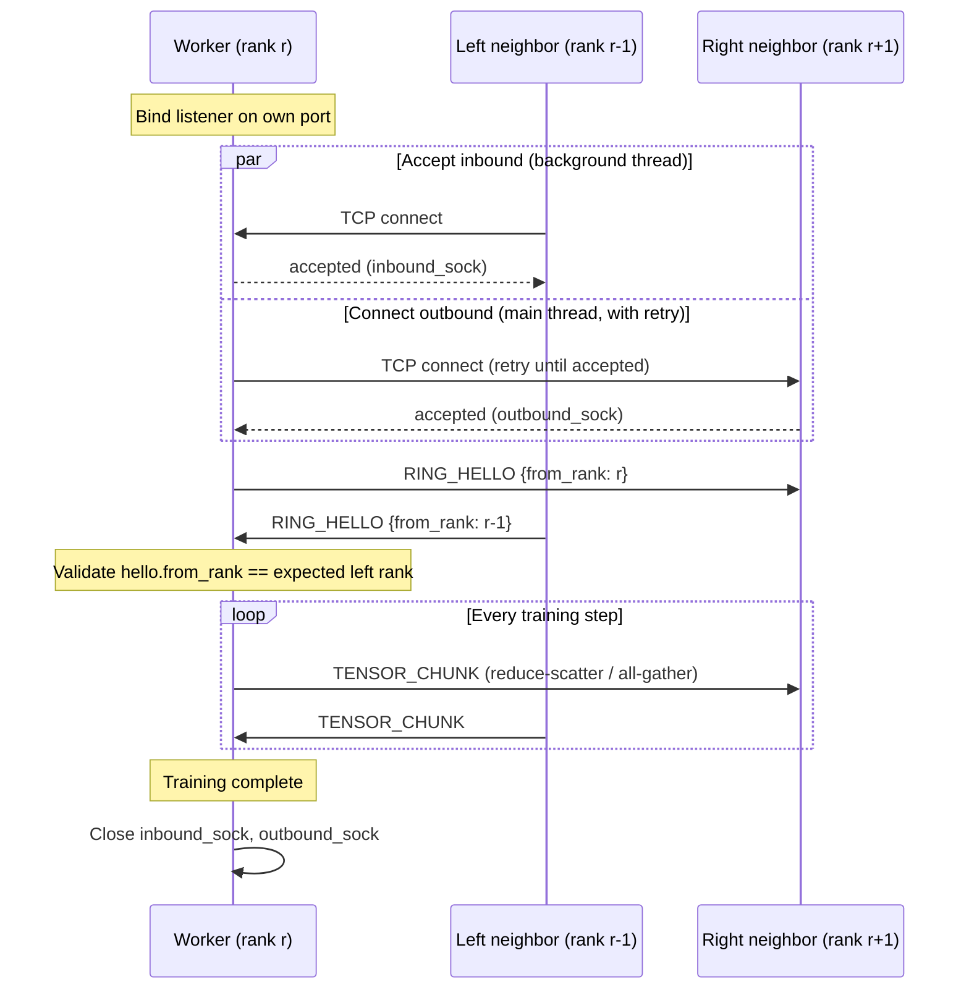

# RingSync Wire Protocol

This document describes the custom TCP communication protocol used throughout RingSync — every message exchanged between the orchestrator and workers, and every message exchanged between workers during ring all-reduce, uses the format defined here.

Source: `ringsync/network/protocol.py`, `ringsync/network/socket_utils.py`, `ringsync/network/topology.py`.

---

## Introduction

RingSync does not use gRPC, MPI, Apache Thrift, or any existing RPC framework. It communicates over raw TCP sockets with a protocol defined entirely within the project.

This is a deliberate choice, not an oversight. RingSync's purpose is to make the mechanics of distributed communication inspectable end to end. A framework like gRPC would handle framing, serialization, and connection management internally — which is exactly the value it provides in production systems, and exactly what would need to be hidden away for this project to serve its purpose. Every byte that crosses the network in RingSync is accounted for in code that fits in a few hundred lines and can be read start to finish.

This has a direct, unavoidable consequence: **TCP does not provide message boundaries**, and a protocol that wants to send discrete messages — "here is one gradient chunk," "here is one heartbeat" — has to construct that notion of a message itself. That is what the rest of this document covers.

---

## TCP Stream Fundamentals

TCP provides a reliable, ordered **byte stream** between two endpoints. It does not provide messages, packets, or records at the application level — those are illusions that every protocol built on top of TCP (HTTP, gRPC, RingSync's own protocol) has to construct for itself.

Three consequences follow directly from this, and all three have caused real bugs in this codebase during development if not handled explicitly:

**1. Messages do not exist in TCP.** If one side calls `send()` twice, the other side may see those two sends arrive as one `recv()`, as two, or as three-or-more, depending on how the underlying OS and network choose to segment the stream. There is no framing information unless the application puts it there.

**2. `recv()` can return a partial message.** A call to `sock.recv(1024)` is a request for *up to* 1024 bytes — the OS is free to return 1, 500, or 1024, even if more data is already sitting in the socket's receive buffer. Code that treats one `recv()` call as "one message" will work reliably on `localhost`, where round-trip latency is near zero and packets rarely fragment, and then fail intermittently the moment it runs across a real network or between separate containers.

**3. `send()` can transmit only part of the buffer.** Symmetrically, `sock.send(data)` returns the number of bytes actually written to the kernel's send buffer, which can be less than `len(data)` if that buffer is full. Ignoring the return value silently drops the unsent remainder.

```
Sender calls:              What the wire actually carries:           Receiver's recv() calls:

send(b"HELLO")     ---->   H E L L O W O R L D                --->   recv() -> b"HEL"
send(b"WORLD")                                                       recv() -> b"LOWORL"
                                                                       recv() -> b"D"
```

The stream is byte-identical to what was sent, in order — TCP's reliability guarantee holds. But the *chunking* the receiver observes has no relationship to the chunking the sender used. Any protocol that needs "messages" has to encode where each one starts and ends, explicitly, inside the stream itself. That is what message framing solves.

---

## Message Framing

Every message in RingSync — control-plane JSON and ring-plane tensor data alike — is wrapped in the same fixed 9-byte header before being written to the socket:

```
 0        1                                            9                epsilon
 +--------+--------------------------------------------+------------------+
 | type   | payload_length                              | payload          |
 | 1 byte | 8 bytes (big-endian, unsigned)               | N bytes          |
 +--------+--------------------------------------------+------------------+
```

Packed with Python's `struct` module using the format string `"!BQ"`:

- `!` — network (big-endian) byte order, ensuring the same bytes are interpreted identically regardless of the host machine's native endianness
- `B` — unsigned char, 1 byte: the message type
- `Q` — unsigned long long, 8 bytes: the payload length in bytes

`HEADER_SIZE = struct.calcsize("!BQ") = 9`.

The receiving side always performs the same two-step read, regardless of message type:

1. Read exactly 9 bytes. Unpack them to learn the message type and the exact payload length.
2. Read exactly that many more bytes. That is the complete payload — no scanning for a delimiter, no ambiguity about where the message ends.

This is the standard length-prefixed framing pattern, and it was chosen over the two common alternatives for concrete reasons:

- **Delimiter-based framing** (e.g. newline-terminated messages) requires escaping the delimiter if it can appear in the payload — and RingSync's payloads include raw binary tensor data, where every byte value including the delimiter's is a legitimate value. Length-prefixing has no such restriction.
- **Fixed-size messages** would waste bandwidth on small control messages (a heartbeat becomes as large as the biggest possible gradient chunk) or require multiple message types with different fixed sizes, adding complexity without adding a real benefit.

A 1-byte type field keeps the header itself tiny and fixed-size regardless of message type, and routing on the receiving end is a simple integer comparison rather than a string comparison or lookup.

---

## Message Types

All message types are defined as a single `IntEnum` in `ringsync/network/protocol.py`, split into two logical planes that never share a socket: the **control plane** (orchestrator &harr; worker) and the **ring plane** (worker &harr; worker, during training).

| Type | Value | Plane | Purpose | Direction | Payload | Expected Response |
|---|---|---|---|---|---|---|
| `REGISTER` | 1 | Control | A worker announces itself to the orchestrator at startup | Worker &rarr; Orchestrator | JSON (rank, host/port) | `REGISTER_ACK` |
| `REGISTER_ACK` | 2 | Control | Acknowledges successful registration | Orchestrator &rarr; Worker | JSON (`{"ok": true}`) | none |
| `HEARTBEAT` | 3 | Control | Periodic liveness signal | Worker &rarr; Orchestrator | JSON (rank) | `HEARTBEAT_ACK` |
| `HEARTBEAT_ACK` | 4 | Control | Confirms the heartbeat was received | Orchestrator &rarr; Worker | JSON (`{"ok": true}`) | none |
| `JSON` | 20 | Control | Generic request/response envelope, currently used for roster queries (`GET_ROSTER`) | Either direction | JSON (arbitrary) | Context-dependent |
| `SHUTDOWN` | 7 | Control | Requests or acknowledges orchestrator shutdown | Either direction | JSON (`{"ok": true}`) | `SHUTDOWN` (echoed) |
| `RING_HELLO` | 10 | Ring | Handshake sent immediately after a ring connection is established, to confirm neighbor identity | Worker &rarr; Worker | JSON (`{"from_rank": int}`) | none (validated synchronously) |
| `TENSOR_CHUNK` | 11 | Ring | One chunk of a gradient buffer, exchanged during a reduce-scatter or all-gather step | Worker &rarr; Worker | Raw `float32` bytes | none (ring all-reduce is fully synchronous by construction; see below) |

Two further values are reserved in the enum but **not currently wired into any active code path**: `START_EPOCH` (5) and `WORKER_EVICTED` (6) in the control plane, and `BARRIER_ENTER` (12) / `BARRIER_RELEASE` (13) in the ring plane. They exist as placeholders for planned functionality — explicit epoch synchronization and an explicit barrier primitive — that is not yet implemented; documenting this honestly here rather than describing behavior that doesn't exist.

**A note on `TENSOR_CHUNK` and "no expected response":** ring all-reduce does not use a request/response pattern for tensor exchange. Each step, every worker sends a chunk to its right neighbor while simultaneously receiving a chunk from its left neighbor (on separate threads — see [ring-allreduce.md](ring-allreduce.md)). The synchronization is implicit: a `recv_exact()` call blocks until data arrives, which is what keeps every worker in lockstep without a separate barrier message.

---

## `send_exact()`

```python
def send_exact(sock: socket.socket, data: bytes) -> None:
    total_sent = 0
    view = memoryview(data)
    while total_sent < len(data):
        sent = sock.send(view[total_sent:])
        if sent == 0:
            raise ConnectionClosedError("Socket connection broken during send")
        total_sent += sent
```

`socket.send()` returns the number of bytes actually written, which can be fewer than requested if the kernel's send buffer is temporarily full. `send_exact()` loops, re-attempting with whatever remains, until the entire buffer has been handed to the kernel.

Two details are worth calling out:

- **`memoryview(data)`** avoids copying the remaining bytes on every loop iteration. Slicing a `bytes` object (`data[total_sent:]`) allocates a new bytes object each time; slicing a `memoryview` does not.
- **`sent == 0` is treated as a hard error**, not a retry condition. A `send()` returning 0 on a connected TCP socket indicates the peer has closed the connection — retrying would loop indefinitely against a socket that will never accept more data.

Every write in RingSync — header and payload alike — goes through this function. There is no direct call to `socket.send()` anywhere else in the codebase.

---

## `recv_exact()`

```python
def recv_exact(sock: socket.socket, num_bytes: int) -> bytes:
    chunks = []
    bytes_received = 0
    while bytes_received < num_bytes:
        chunk = sock.recv(min(num_bytes - bytes_received, 65536))
        if chunk == b"":
            raise ConnectionClosedError("Socket connection broken during recv")
        chunks.append(chunk)
        bytes_received += len(chunk)
    return b"".join(chunks)
```

The algorithm, step by step:

1. Compute how many bytes are still needed (`num_bytes - bytes_received`).
2. Call `recv()` requesting at most that many bytes, capped at 65536 per call — an arbitrarily chosen but conventional upper bound that avoids requesting an unreasonably large single read for big tensor payloads.
3. An empty bytes object (`b""`) returned from `recv()` is TCP's signal that the peer performed an orderly shutdown — this is the receive-side equivalent of `send()` returning 0, and is treated the same way: a hard error, not something to retry against.
4. Otherwise, append what was received and update the running total.
5. Repeat until the running total equals the requested `num_bytes`, then concatenate all chunks into a single `bytes` object and return it.

`join()` on a list of chunks is used instead of repeated bytes concatenation (`result += chunk`) because bytes objects are immutable in Python — repeated `+=` would reallocate and copy the entire accumulated buffer on every iteration, turning what should be a linear-time operation into a quadratic one for large payloads (a full gradient chunk arriving over many small TCP segments).

Every read in RingSync — the 9-byte header and the payload that follows — goes through this function.

---

## Serialization

RingSync uses two serialization strategies, chosen deliberately by payload kind rather than uniformly.

**Control-plane messages** (registration, heartbeats, roster queries) are JSON, via `send_json()` / `recv_json()` — thin wrappers around `send_message()` / `recv_message()` that encode/decode a Python `dict`. These messages are small, infrequent, and benefit from being human-readable during debugging (a captured heartbeat message can be read directly).

**Ring-plane tensor data** is serialized as raw `float32` bytes via NumPy (`tensor_to_bytes()` / `bytes_to_tensor()`), explicitly *not* pickle:

```python
def tensor_to_bytes(arr: np.ndarray) -> bytes:
    return np.ascontiguousarray(arr, dtype=np.float32).tobytes()

def bytes_to_tensor(data: bytes, shape: "tuple[int, ...]") -> np.ndarray:
    arr = np.frombuffer(data, dtype=np.float32)
    return arr.reshape(shape)
```

The reasoning, by dimension:

- **Performance.** `tobytes()` / `frombuffer()` operate on the array's underlying memory buffer directly, with no intermediate object graph to walk. Pickle serializes a general Python object graph and carries meaningfully more overhead per call — a cost paid on every single training step, for every gradient chunk, at every worker.
- **Security.** Unpickling arbitrary data can execute arbitrary code, by design — pickle's format includes opcodes for constructing and invoking objects. That is a legitimate concern for any data crossing a process or network boundary, gradient chunks included. Raw float bytes have no such capability; there is nothing to execute, only numbers to reinterpret.
- **Memory.** No duplicate object graph is constructed during serialization. `np.ascontiguousarray()` only copies if the array isn't already contiguous in memory (a `.T` view, for instance) — the common case of an already-contiguous gradient tensor is copy-free.
- **Simplicity.** Shape and dtype are not embedded in the wire payload. Sender and receiver already agree on both out of band — every worker holds an identical model architecture and independently computes the same chunk boundaries — so there is nothing to negotiate at the protocol level. This keeps the ring-plane payload as exactly the bytes needed and nothing more.

---

## Connection Lifecycle



**Establishment.** Every worker is simultaneously a server (for its left neighbor) and a client (for its right neighbor). Each worker first binds a listener on its own assigned port, then does two things concurrently: accepts an inbound connection on a background thread, and dials its right neighbor on the main thread, retrying with a fixed interval (0.3s, up to 100 attempts) since there is no guaranteed startup order across a ring of independently-launched processes — a `ConnectionRefusedError` on an early attempt simply means that neighbor hasn't started listening yet.

**Handshake.** Once both directions are connected, each worker sends a `RING_HELLO` containing its own rank to its right neighbor, and reads the `RING_HELLO` its left neighbor sent to it. The received rank is checked against the rank that *should* be arriving from the left, given the configured world size. A mismatch — most commonly caused by an incorrectly ordered address list — raises immediately, converting a misconfiguration that would otherwise silently produce wrong gradients into a loud startup failure.

**Steady state.** For the remainder of training, the same two sockets (`inbound_sock`, `outbound_sock`) are reused for every single step's ring all-reduce — connections are established once, not per-step. Every message in this phase is `TENSOR_CHUNK`.

**Shutdown.** Sockets are closed explicitly once training completes. There is currently no distinct ring-plane shutdown message; closing the connection is itself the signal, observed by the peer as `recv_exact()` receiving an empty read and raising `ConnectionClosedError` if it is still waiting on a message at that point — which, in an orderly shutdown after the last step, it is not.

---

## Error Handling

**Broken sockets and unexpected disconnects** are surfaced through a single, deliberately narrow exception: `ConnectionClosedError`, raised by `send_exact()` when `send()` returns 0 and by `recv_exact()` when `recv()` returns `b""`. Both conditions mean the same underlying thing — the peer is gone — regardless of which side of the exchange detected it, and both are treated as hard failures rather than retried, since a closed connection will not spontaneously reopen.

**Connection establishment timeouts** are handled at the topology layer, not the protocol layer: `_connect_outbound()` retries a bounded number of times (100 attempts at 0.3s intervals — a 30-second budget) before raising `ConnectionError`, and the background accept thread is joined with an explicit 30-second timeout in `setup_ring()`. Both bounds exist so that a genuinely misconfigured or unreachable peer fails loudly within a predictable window, rather than hanging indefinitely.

**Heartbeat failures** are handled at the orchestrator layer (see [architecture.md](architecture.md) for the full fault-detection design): a worker that stops sending `HEARTBEAT` messages is not detected by the wire protocol itself — the protocol has no timeout on individual `recv()` calls — but by the orchestrator's own liveness-tracking loop, which evicts a worker after a configured number of consecutive missed heartbeats and triggers shard redistribution among the survivors.

**What is explicitly not handled at the protocol layer:** partial delivery of a single `TENSOR_CHUNK` mid-flight is invisible to the protocol above the framing layer — `recv_exact()` guarantees the full payload arrives before returning, by construction, or raises. There is currently no checksum or corruption-detection field in the frame header; TCP's own checksum is relied upon for byte-level integrity, which is a reasonable assumption for this protocol's threat model (accidental corruption on a trusted network) but would be insufficient if RingSync were ever extended to operate over an untrusted network (see TLS, under Future Improvements).

---

## Design Decisions

**Why raw sockets instead of an existing RPC framework?** Covered in the Introduction: the entire point of this protocol is to make framing, serialization, and connection handling visible rather than delegated. This is a legitimate tradeoff *for this project's purpose* — it would be the wrong choice for a production system, where gRPC's mature handling of retries, load balancing, streaming, and cross-language support delivers real value that would take considerable effort to reproduce correctly.

**Why TCP rather than UDP?** Ring all-reduce requires every chunk to arrive, in order, exactly once — a dropped or reordered chunk during reduce-scatter would silently corrupt every subsequent step's gradient average, with no obvious symptom until the model failed to converge. TCP provides these guarantees natively. UDP would require rebuilding them at the application layer, which is a well-trodden but nontrivial path (this is, at a high level, what QUIC exists to do) and was not judged worth the complexity for a single-machine, localhost-only protocol.

**Why a 1-byte type field rather than a string or UUID?** A fixed 1-byte field keeps the header itself a fixed, tiny, predictable size (9 bytes, always) and routing is a simple integer comparison. A string type would require its own length-prefixing inside the header, and a UUID would spend 16 bytes identifying one of fewer than 20 known message types.

**Why is the payload length 8 bytes rather than 4?** A 4-byte unsigned length field caps a single message at 4 GiB, which is far beyond any payload RingSync currently sends but is a real ceiling other protocols have hit in practice. 8 bytes costs 4 extra bytes per message header — negligible relative to typical payload sizes — in exchange for a ceiling that will not need revisiting.

**Why is JSON used for control-plane messages instead of the same binary approach as tensors?** Control messages are small and infrequent enough that JSON's overhead is irrelevant, and the readability benefit during development and debugging (inspecting a captured heartbeat or registration message directly) outweighs the minor encoding cost.

---

## Future Improvements

The following are not implemented, and are documented here as genuine possible directions rather than a promised roadmap:

- **TLS.** The protocol currently assumes a trusted network (localhost or a trusted LAN). Any deployment across an untrusted network would need TLS termination on every socket, which would also address the checksum/corruption-detection gap noted under Error Handling.
- **Compression.** Gradient chunks are currently sent as raw, uncompressed `float32` bytes. A general-purpose compressor (or gradient-specific quantization) could reduce bytes-on-the-wire at the cost of CPU time spent compressing/decompressing — a tradeoff that would need to be measured, not assumed, given RingSync's own benchmarking philosophy.
- **Zero-copy I/O.** `recv_exact()` currently copies data into Python-level `bytes` chunks and joins them. Platforms that expose `sendfile()`-style zero-copy paths, or Python's own buffer protocol used more aggressively, could reduce copies for large tensor payloads.
- **RDMA.** Remote Direct Memory Access would bypass the kernel's TCP stack entirely for supported hardware, which is exactly what NCCL uses on GPU clusters. This would be a substantial rewrite of the transport layer, not an incremental change to the existing socket code.
- **Async I/O.** The current implementation uses blocking sockets and threads (one thread per concurrent direction). An `asyncio`-based implementation could handle many connections without a thread per connection, which matters more as world size grows well beyond what a ring topology's O(1) per-worker connection count currently requires.
- **Connection pooling / reconnection.** There is currently no reconnection logic if a ring connection drops mid-training — the run simply fails. A production-oriented version would need a defined reconnection and resynchronization protocol, which is a meaningfully harder problem than the initial connection establishment described above.
