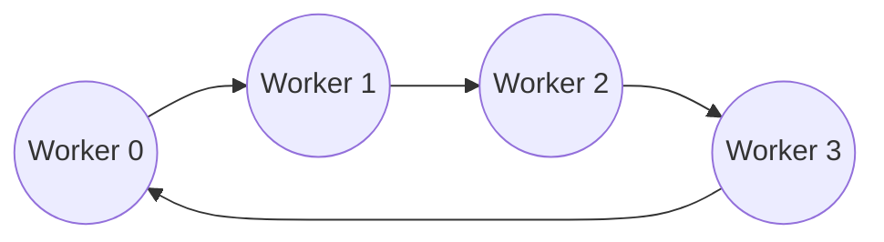

# Ring All-Reduce in RingSync

This document explains the ring all-reduce algorithm as implemented in RingSync — the mechanism by which every worker's independently-computed gradient becomes a single, identical, averaged gradient across the entire ring, without any central coordinator performing the summation.

Source: `ringsync/allreduce/ring_allreduce.py`, `ringsync/worker/grad_utils.py`.

Every numeric example in this document was independently verified by running RingSync's actual `ring_all_reduce()` function, not hand-derived and left unchecked — the intermediate values shown in the Complete Example section below are the real output of the real code.

---

## What is Ring AllReduce?

All-reduce is a collective communication operation: every participant contributes a value, and every participant receives the same combined result — in RingSync's case, elementwise sum (or average) across all workers' gradients. The "ring" qualifier describes *how* that reduction is achieved: workers are arranged in a logical cycle, each communicating only with its two neighbors, and the reduction happens as data circulates around that cycle rather than flowing through any single coordinating node.

This is in direct contrast to a **parameter server** architecture, where every worker sends its gradient to one or more central server nodes, which perform the summation and send the result back out. A parameter server is conceptually simpler, but the server's incoming bandwidth scales with the number of workers — at some worker count, the server's network interface becomes the bottleneck, and the server itself is a single point of failure. Ring all-reduce has no such node: every worker does an equal, fixed amount of communication work regardless of how many workers are in the ring, which is the property the next section explains in more depth.

Ring all-reduce is not a RingSync invention — it is the same general approach used internally by NCCL and Horovod for GPU cluster training. What RingSync does is implement it from scratch, in plain Python, so its mechanics are directly inspectable rather than hidden inside a compiled communication library.

---

## Why Ring AllReduce?

**Bandwidth efficiency.** As shown in the Computational Complexity section below, each worker sends and receives exactly `2(N-1)/N` times its gradient size, total, for the entire all-reduce — not `2(N-1)` times, and not proportional to the number of *other* workers multiplied by anything. For large `N`, this ratio approaches 2, a constant, regardless of how many workers are participating.

**Scalability.** Because per-worker communication volume is bounded by a constant (not growing with `N`), adding more workers does not add more communication burden onto any single node. This is what allows ring all-reduce to scale to large clusters where a parameter-server approach would eventually saturate its central node's network link.

**No central bottleneck.** Every worker communicates with exactly two neighbors — its ring predecessor and successor — never with a distinguished "central" node. There is no single machine whose failure halts every worker, and no single machine whose network interface caps the whole system's throughput.

**Equal communication load.** Every worker sends the same amount of data and receives the same amount of data, every round. No worker is privileged or burdened relative to any other — a direct consequence of the ring's symmetry, and part of why the algorithm's performance is predictable and uniform across workers.

---

## Mathematical Intuition

Strip away the indexing and the algorithm is answering one question: *given N numbers, one held by each of N machines with no shared memory, how do all N machines end up knowing the sum, doing as little total communication as possible?*

- **Reduce** means combining multiple values into one via some operation — here, addition. If four workers each hold a number, "reducing" them means computing their sum.
- **Scatter** means distributing different pieces of data to different destinations, so that no two destinations necessarily hold the same piece. In this algorithm, each worker ends up owning a *different* slice of the fully-reduced result — the reduction work itself is scattered across the ring rather than done by one machine.
- **Gather** is the reverse: collecting scattered pieces back together at every destination, so each one ends up with the complete picture rather than just its own slice.
- **Average** is simply the reduced sum divided by the number of contributors (`N`) — used here because the training objective is the *average* gradient across all workers' local batches, not the raw sum.
- **Synchronization** is the guarantee that every worker finishes the operation holding an identical result. In a ring, this falls out of the algorithm's structure: by the time all-gather completes, every worker has received every fully-reduced chunk, in the same order, via the same deterministic sequence of exchanges.

Ring all-reduce achieves all of this in two phases — reduce-scatter, then all-gather — each taking exactly `N-1` steps, described in full detail next.

---

## Reduce-Scatter

**Setup.** Each worker's local gradient array is split into `N` contiguous chunks (`N` = world size). Every worker performs this identical split on its own, independently-computed gradient — so at the start, worker `r`'s chunk `i` is *its own* locally-computed value, generally different from every other worker's chunk `i`.



**The loop.** For `N-1` steps, every worker simultaneously:

1. Sends one specific chunk (determined by the formula below) to its right neighbor.
2. Receives a chunk from its left neighbor, and **adds** it into its own copy of the corresponding chunk.

The exact chunk index sent and received at step `s` by worker (rank) `r`, in a ring of size `N`, is:

```
send_idx = (r - s)     mod N
recv_idx = (r - s - 1) mod N
```

This specific offset pattern is what guarantees that after `N-1` steps, every chunk has been summed across *all* `N` workers exactly once, with no chunk summed twice and none left out — each worker's chunks "rotate" through the ring at a fixed offset, picking up one more worker's contribution per step.

**After `N-1` steps**, worker `r` holds the *fully reduced* value for exactly one chunk index: `(r + 1) mod N`. Every worker owns a different chunk, and each owned chunk is complete — the sum of that chunk's value across all `N` workers. This is the "scatter" in reduce-scatter: the fully-reduced result is scattered one chunk per worker across the ring, rather than any single worker ending up with the whole thing.

**How accumulation actually happens, concretely (2 workers' view, generalizes to N):** at each step, a worker never overwrites the incoming data — it always adds it (`chunks[recv_idx] = chunks[recv_idx] + incoming`) to what it already has for that index, which may itself already be a partial sum from an earlier step. By the final step, this chain of additions has touched every worker's contribution to that one chunk.

---

## All-Gather

Reduce-scatter ends with the fully-reduced result scattered — one complete chunk per worker, but no worker has more than its own one chunk. All-gather's job is to circulate those already-complete chunks around the ring so that every worker ends up holding all `N` of them.

**The loop.** Starting from the chunk index each worker owns after reduce-scatter (`owned_idx`), for `N-1` steps every worker simultaneously:

1. Sends the chunk it currently holds at a specific index to its right neighbor.
2. Receives a chunk from its left neighbor and **overwrites** (not adds — these chunks are already fully reduced; there is nothing left to accumulate) the corresponding slot.

```
send_idx = (owned_idx - s)     mod N
recv_idx = (owned_idx - s - 1) mod N
```

**After `N-1` steps**, every worker has received every other worker's originally-owned chunk, in addition to the one it started with — `N` chunks total, all fully reduced, held by all `N` workers. This is the "gather": the scattered pieces converge back into a complete picture, but a complete picture that now exists identically everywhere rather than requiring a final collection step at one destination.

---

## Complete Example

Four workers (`N = 4`), each holding a local gradient of 16 values, split into 4 chunks of 4 values each — chunks **A** (values 0–3), **B** (4–7), **C** (8–11), **D** (12–15).

To make every intermediate sum easy to verify by eye, each worker's chunk values are chosen at a different order of magnitude:

| | Chunk A | Chunk B | Chunk C | Chunk D |
|---|---|---|---|---|
| Worker 0 | 1 | 2 | 3 | 4 |
| Worker 1 | 10 | 20 | 30 | 40 |
| Worker 2 | 100 | 200 | 300 | 400 |
| Worker 3 | 1000 | 2000 | 3000 | 4000 |

*(each cell represents 4 identical values, e.g. Worker 0's chunk A is literally `[1, 1, 1, 1]` — shown as a single number here for readability)*

The correct final answer, computable by inspection, is the column sums: **A = 1111, B = 2222, C = 3333, D = 4444**.

### Reduce-Scatter, round by round

| Step | What moves | Worker 0's state | Worker 1's state | Worker 2's state | Worker 3's state |
|---|---|---|---|---|---|
| Start | — | A=1, B=2, C=3, D=4 | A=10, B=20, C=30, D=40 | A=100, B=200, C=300, D=400 | A=1000, B=2000, C=3000, D=4000 |
| 1 | Each sends chunk `r`; W0→W1→W2→W3→W0 | D = 4 + 4000 = **4004** | A = 10 + 1 = **11** | B = 200 + 20 = **220** | C = 3000 + 300 = **3300** |
| 2 | Each sends its most-recently-updated chunk onward | C = 3 + 3300 = **3303** | D = 40 + 4004 = **4044** | A = 100 + 11 = **111** | B = 2000 + 220 = **2220** |
| 3 (final) | Same pattern | **B = 2 + 2220 = 2222** ✓ | **C = 30 + 3303 = 3333** ✓ | **D = 400 + 4044 = 4444** ✓ | **A = 1000 + 111 = 1111** ✓ |

After 3 steps (`N-1 = 3`), each worker owns exactly one fully-reduced chunk: **Worker 0 → B, Worker 1 → C, Worker 2 → D, Worker 3 → A** — matching the `(rank + 1) mod N` rule exactly. These are not approximations; running RingSync's actual `ring_reduce_scatter()` on these exact input values produces precisely these four owned values.

### All-Gather, round by round

Starting point: W0 owns B=2222, W1 owns C=3333, W2 owns D=4444, W3 owns A=1111.

| Step | W0 holds | W1 holds | W2 holds | W3 holds |
|---|---|---|---|---|
| Start | B | C | D | A |
| 1 | B, A | C, B | D, C | A, D |
| 2 | B, A, D | C, B, A | D, C, B | A, D, C |
| 3 (final) | **A, B, C, D** | **A, B, C, D** | **A, B, C, D** | **A, B, C, D** |

After 3 more steps, every worker holds all four fully-reduced chunks — `[1111, 2222, 3333, 4444]` (repeated 4 times each, for the original 16-value length). If `average=True` (RingSync's default), this is divided by `N=4` before being written back into `.grad`.

---

## Computational Complexity

For `N` workers and a gradient of size `S` (elements):

| Metric | Cost |
|---|---|
| **Rounds (reduce-scatter)** | `N - 1` |
| **Rounds (all-gather)** | `N - 1` |
| **Total rounds** | `2(N - 1)` |
| **Data sent per worker, total** | `2(N-1)/N × S` — approaches `2S` as `N` grows, independent of `N` |
| **Data sent per round** | `S / N` (one chunk) |
| **Peak extra memory per worker** | `O(S)` — one buffer for the flattened gradient, plus temporary chunk buffers of total size `O(S/N)` per round |

**Latency** scales with the *number of rounds* (`2(N-1)`), not with `S` directly — each round incurs a fixed per-message overhead (socket send/receive, thread scheduling for the concurrent exchange) regardless of chunk size. This is why ring all-reduce's round count, not its total bytes moved, tends to dominate at small message sizes or high worker counts: more workers means more rounds even though total bytes-per-worker stays roughly constant.

**Bandwidth** is the `2(N-1)/N × S` figure above — asymptotically optimal for a ring topology, meaning no all-reduce algorithm using only nearest-neighbor ring communication can move less data per worker and still guarantee every worker ends up with the complete result.

---

## Deadlock Prevention

Every step in both phases requires each worker to *send* to its right neighbor and *receive* from its left neighbor. If this were implemented as two sequential blocking calls — `send()` then `recv()` — every worker in the ring would call `send()` at the same time, and every `send()` would block waiting for its destination to be ready to receive... except every destination is itself still blocked inside its own `send()` call, not yet at the point of calling `recv()`. No worker ever reaches `recv()`. The entire ring deadlocks, permanently, the very first round.

RingSync avoids this with the `_exchange()` helper: the send happens on a background thread while the receive happens on the calling thread, and the two are joined afterward.

```python
def _exchange(send_fn, recv_fn, to_send):
    received = [None]
    def _do_recv():
        received[0] = recv_fn()
    recv_thread = threading.Thread(target=_do_recv)
    recv_thread.start()
    send_fn(to_send)
    recv_thread.join()
    return received[0]
```

With every worker's receive already running concurrently with its send, the ring's dependency cycle is broken: worker `r`'s send can complete because worker `r+1` is simultaneously ready to receive it (its own receive thread is already running), regardless of what order the workers happened to reach this point in.

---

## Gradient Flattening

A model's gradients exist as one tensor per parameter — a small CNN in RingSync has on the order of a dozen separate tensors (convolution kernels, biases, linear weights), each a different shape. Running ring all-reduce independently on each tensor would mean `2(N-1)` network round-trips *per tensor*, per training step — for a model with dozens or hundreds of parameter tensors, that multiplies the fixed per-round overhead (socket calls, thread scheduling) by the parameter count, for no benefit, since the actual bytes needing to move are identical either way.

Instead, RingSync flattens every parameter's gradient into a single one-dimensional buffer before the ring exchange (`ringsync/worker/grad_utils.py`), in a fixed, identical order across every worker (`model.named_parameters()`'s natural iteration order), and un-flattens the result back into each parameter's `.grad` afterward. This means exactly one ring all-reduce call — `2(N-1)` rounds total — per training step, regardless of how many parameter tensors the model has.

This is conceptually the same idea production frameworks call **gradient bucketing**: grouping many small tensors into fewer, larger communication buffers to amortize fixed per-message overhead across more actual payload. RingSync's version is the simplest possible case of bucketing — one bucket containing the entire model — rather than the more elaborate multi-bucket, overlap-with-backward-pass scheduling that PyTorch DDP implements (see Comparison, below).

---

## Correctness

Every worker finishing with an identical gradient is not incidental — it follows directly from the algorithm's structure, given three preconditions that RingSync's implementation guarantees:

1. **Every worker performs the identical sequence of chunk indices**, since `send_idx`/`recv_idx` are pure functions of `rank`, `step`, and `world_size` — values every worker already has, requiring no additional coordination to agree on.
2. **Every worker's flattened gradient buffer has the same length and the same chunk boundaries**, since every worker holds an architecturally identical model (`compute_chunk_boundaries()` is a pure function of buffer length and world size).
3. **Addition is commutative and associative**, so the order in which a chunk's contributions are summed across rounds does not affect the final total — only that every contribution is included exactly once, which the index math above guarantees.

Given these three, the Complete Example's verification generalizes: for any `N` and any gradient content, every worker's final buffer is the same elementwise sum (or average), because every worker executes the same deterministic communication pattern over data whose combination doesn't depend on order.

**Why `optimizer.step()` is safe to call locally, with no further coordination, immediately after all-reduce completes:** by the time `ring_all_reduce()` returns, every worker's `.grad` tensors are already identical, bit-for-bit (this is empirically verified in RingSync's integration tests — see `tests/test_worker_integration.py`, which confirms `0.00e+00` divergence across real separate processes). An optimizer step is a deterministic function of the current parameters and the current gradient, both of which are now identical across every worker. Applying that same deterministic function locally, on every worker, independently, therefore produces identical updated parameters everywhere — no further communication is needed for this step, which is precisely why synchronous data-parallel training only needs to communicate once per step, at the gradient, not at the parameters.

---

## Comparison

**PyTorch DDP.** Uses ring all-reduce (via NCCL or Gloo) as its underlying collective, conceptually the same two-phase algorithm described here. The meaningful differences: DDP overlaps communication with the backward pass (starting to all-reduce a parameter's gradient as soon as it's computed, rather than waiting for the entire backward pass to finish, as RingSync does), and buckets gradients into multiple groups rather than RingSync's single whole-model bucket, to balance communication-start latency against per-message overhead.

**NCCL.** Implements ring all-reduce (among other topologies — tree-based algorithms for latency-sensitive small messages, for instance) at a much lower level: GPU-to-GPU transfers, often over specialized interconnects (NVLink, InfiniBand) that bypass the host CPU and OS network stack entirely. RingSync's version operates purely over CPU and standard TCP sockets — the algorithmic structure is the same; the transport is not.

**Horovod.** Also built around ring all-reduce, historically popularized the technique for deep learning specifically (adapting an approach from HPC). Horovod is a general-purpose library supporting multiple deep learning frameworks and backend collectives (NCCL, MPI, Gloo); RingSync implements one specific version of the algorithm for one specific framework, with no configurability of the underlying transport.

**Parameter Server.** A genuinely different algorithm, not a variant of ring all-reduce: gradients flow to and from central server node(s) rather than circulating through a ring. It remains a reasonable choice for asynchronous training or when the server can be sharded across enough machines to avoid a bandwidth bottleneck — RingSync's synchronous, ring-based design is a different point in the design space, not a strict improvement.

None of the above should be read as RingSync outperforming or replacing these systems — they solve the same core problem at production scale, with substantially more engineering (GPU transport, fault recovery, multi-framework support, years of optimization) behind them. RingSync's value is in making the underlying algorithm's mechanics fully inspectable in a few hundred lines of plain Python.

---

## Future Work

- **Compression.** Sending quantized or sparsified gradients instead of full-precision `float32` would reduce bytes moved per round, at the cost of approximation error that would need to be measured against convergence behavior.
- **Mixed precision.** Computing and communicating gradients in a lower-precision format (e.g. `float16`) for eligible parameters, halving communication volume for those tensors.
- **GPU collectives.** Extending the transport layer to move tensors directly between GPU memory (rather than the current CPU-only path), which is the actual regime NCCL is built for.
- **Hierarchical all-reduce.** For very large worker counts, a two-level ring (reduce within a machine's local workers first, then across machines) reduces the number of slow inter-machine hops relative to fast intra-machine ones — a well-known technique for scaling beyond a single flat ring's practical limits.
- **Elastic training.** Supporting workers joining or leaving mid-run, which requires a substantially more involved recovery protocol than RingSync's current epoch-boundary-only fault handling (see [architecture.md](architecture.md)).
- **Multi-node.** The algorithm itself makes no assumption about workers sharing a machine — RingSync's current testing is localhost-only, but genuine multi-machine operation is a natural extension requiring no change to the ring all-reduce logic itself, only to deployment and address configuration.
